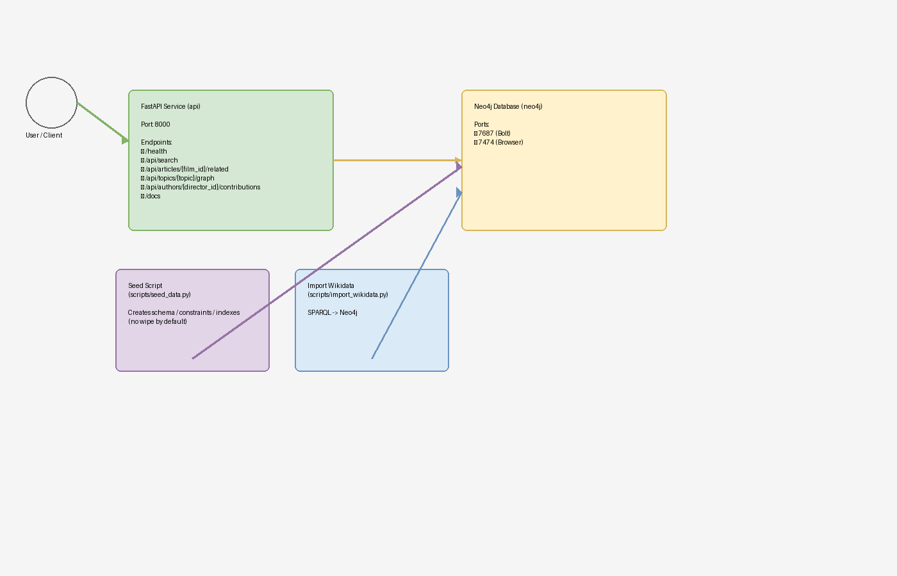
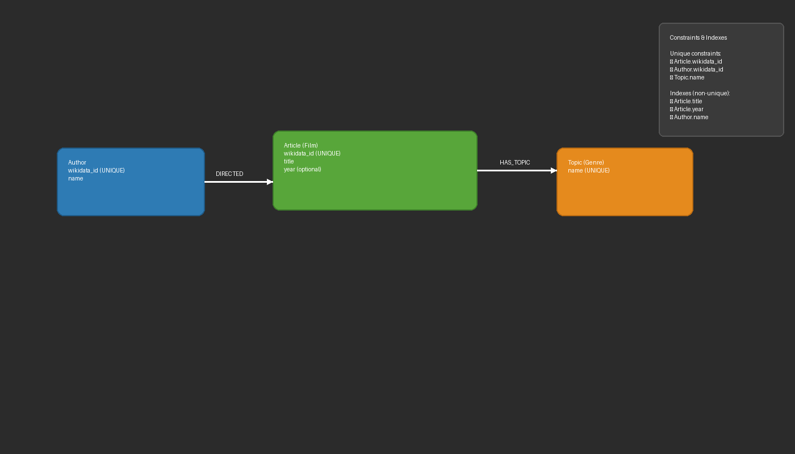
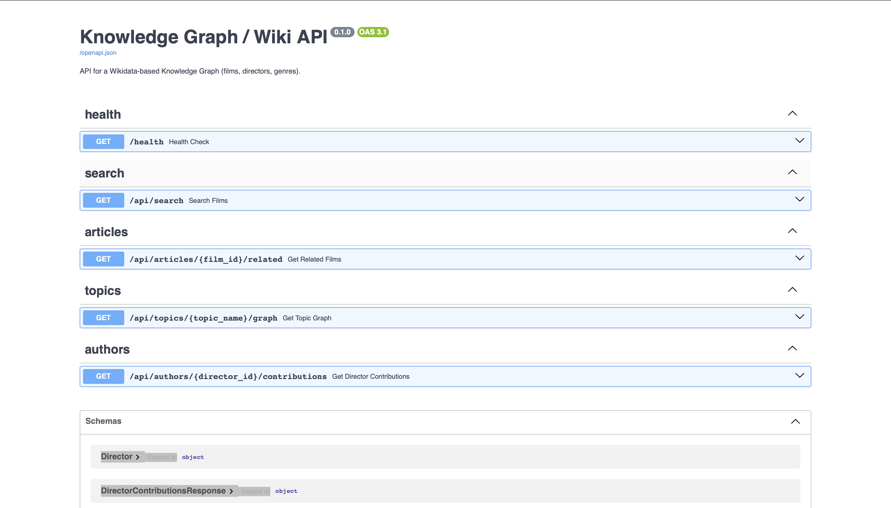
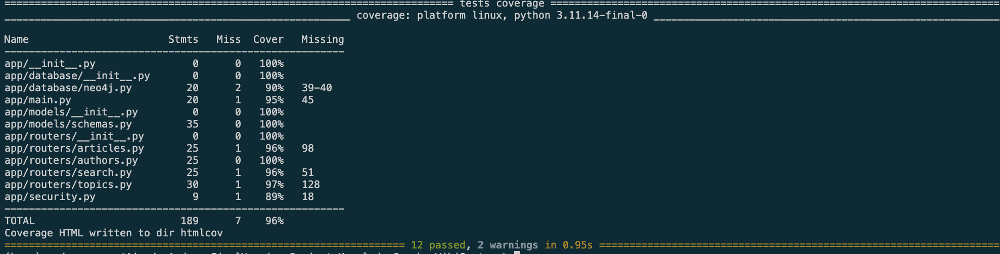
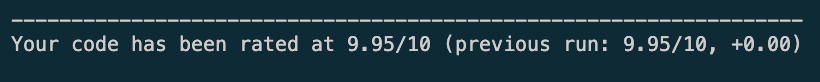
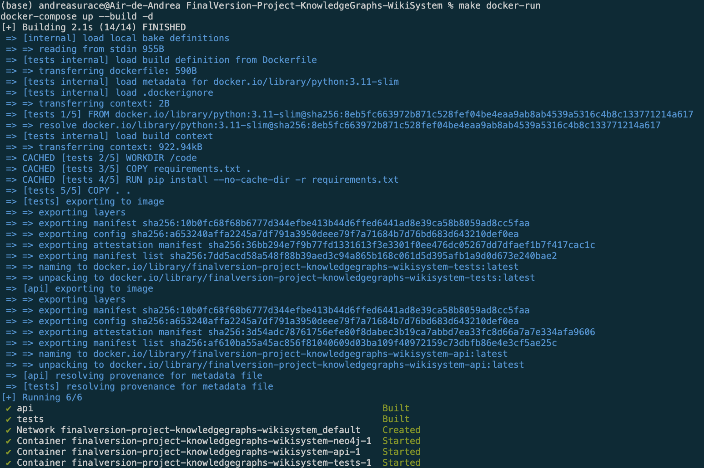

# Knowledge Graph API – Wikidata Film Explorer

**Projet AIDAMS 3A – Graph Databases & Knowledge Graphs**

Ce projet a été réalisé dans le cadre du cours **Graph Databases & Knowledge Graphs**.
Il consiste à concevoir une **API REST de Knowledge Graph** basée sur **Neo4j** et **FastAPI**, permettant l’exploration avancée d’un graphe réel issu de **Wikidata** (films, réalisateurs, genres).

---

## 👥 Équipe & Organisation

| Nom                     | Rôle                                   |
| ----------------------- | -------------------------------------- |
| **Paul Pascal**         | Team Lead                              |
| Andrea Surace Gomez     | Member                                 |
| Toscane Cesbron Darnaud | Member                                 |

---

## 1. Objectif du projet

L’objectif de ce projet est de construire une **API de graphes de connaissances** permettant :

* la **modélisation d’un dataset réel** sous forme de graphe,
* l’**exploration relationnelle** via des traversals multi-sauts,
* l’**analyse des contributions d’auteurs**,
* la **recherche de contenu par thème, réalisateur ou titre**,
* la **recommandation de films** basée sur la proximité dans le graphe,
* l’exposition de **requêtes Cypher avancées** via une API FastAPI documentée.

Le projet met en pratique :

* la modélisation Neo4j,
* l’optimisation de requêtes Cypher,
* l’ingestion de données externes,
* les tests automatisés,
* le linting et le déploiement Docker.

---

## 2. Dataset

### Source

Le dataset utilisé est un **dataset réel issu de Wikidata**, récupéré via des requêtes **SPARQL**.

Les données portent sur :

* des **films**,
* leurs **réalisateurs (auteurs)**,
* leurs **genres cinématographiques**.

Les données sont publiques et maintenues par la communauté Wikidata.

### Justification du choix

Ce dataset est particulièrement adapté à une **graph database** car :

* les relations sont centrales (films ↔ auteurs ↔ genres),
* les parcours multi-niveaux sont naturels,
* il permet d’illustrer des **cas d’usage concrets** : recherche, recommandations, similarités.

---

## 3. Architecture du projet

```
.
├── app
│   ├── main.py
│   ├── security.py
│   ├── database
│   │   └── neo4j.py
│   ├── models
│   │   └── schemas.py
│   └── routers
│       ├── search.py
│       ├── articles.py
│       ├── topics.py
│       └── authors.py
├── scripts
│   ├── generate_diagrams.py
│   ├── import_wikidata.py
│   └── seed_data.py
├── docs
│   ├── graph_model.md
│   ├── index_proof.md
│   └── diagrams
│       ├── architecture.drawio
│       ├── architecture.png
│       ├── neo4j_schema.drawio
│       └── neo4j_schema.png
├── tests
│   ├── test_health.py
│   ├── test_search.py
│   ├── test_articles.py
│   ├── test_authors.py
│   ├── test_topics.py
│   ├── test_cyper_queries.py
│   └── test_graph_queries.py
├── docker-compose.yml
├── Dockerfile
├── requirements.txt
├── Makefile
├── demo.ipynb
├── README.md
└── .env.example
```

---

## 4. Diagrams

### System Architecture



* FastAPI (port 8000)
* Neo4j (7474 / 7687)
* Scripts d’ingestion et de seed
* Tests automatisés

### Neo4j Graph Schema



---

## 5. Modèle de graphe Neo4j

### Nœuds

| Label       | Description                           |
| ----------- | ------------------------------------- |
| **Article** | Film (`wikidata_id`, `title`, `year`) |
| **Author**  | Réalisateur                           |
| **Topic**   | Genre cinématographique               |

### Relations

| Relation                               | Description                     |
| -------------------------------------- | ------------------------------- |
| `(:Author)-[:DIRECTED]->(:Article)`    | Un réalisateur a dirigé un film |
| `(:Article)-[:HAS_TOPIC]->(:Topic)`    | Un film appartient à un genre   |
| `(:Topic)-[:CO_OCCURS_WITH]->(:Topic)` | Genres apparaissant ensemble    |

---

## 6. Contraintes & Index Neo4j

Les contraintes et index sont créés automatiquement lors du seed :

### Contraintes d’unicité

* `Article.wikidata_id`
* `Author.wikidata_id`
* `Topic.name`

### Index

* `Article.title`
* `Article.year`
* `Author.name`

👉 L’utilisation effective des index est vérifiée via **EXPLAIN / PROFILE**
📎 Preuves disponibles dans `docs/index_proof.md`.

---

## 7. Data Ingestion & Seed

### Import Wikidata

```bash
make import-wikidata
```

* Requêtes SPARQL vers Wikidata
* Transformation et insertion dans Neo4j
* Pas de wipe par défaut

### Seed

```bash
make seed
```

* Création des contraintes et index
* Construction des relations `CO_OCCURS_WITH`
* Vérification des volumes insérés

---

## 8. API – FastAPI

Documentation interactive Swagger :

👉 [http://localhost:8000/docs](http://localhost:8000/docs)



### Endpoints principaux

| Endpoint                          | Description                    |
| --------------------------------- | ------------------------------ |
| `/health`                         | Healthcheck Neo4j              |
| `/api/search`                     | Recherche de films             |
| `/api/articles/{id}/related`      | Films liés (API key)           |
| `/api/topics/{topic}/graph`       | Sous-graphe autour d’un genre  |
| `/api/authors/{id}/contributions` | Contributions d’un réalisateur |

---

## 9. Requêtes Cypher avancées

Le projet implémente :

* requêtes multi-sauts,
* agrégations (`count`, `ORDER BY`),
* OPTIONAL MATCH,
* requêtes analytiques,
* utilisation de **EXPLAIN / PROFILE**.

📎 Exemples détaillés disponibles dans `docs/index_proof.md`.

---

## 10. Tests & Qualité du code

### Tests

```bash
make test
```

* Tests unitaires et d’intégration (`pytest`)
* Couverture générée (`htmlcov/`)



### Linting

```bash
make lint
```

* Outil : **pylint**
* Configuration : `.pylintrc` (présent à la racine)
* Score obtenu : **9.95 / 10**



---

## 11. Docker & Reproductibilité

Lancement complet du projet :

```bash
make docker-run
```



* Build + lancement Neo4j & API
* Projet entièrement reproductible

Image Docker publique :

👉 [https://hub.docker.com/repository/docker/ppascal92/graph-api/general](https://hub.docker.com/repository/docker/ppascal92/graph-api/general)

---

## 12. Contributions de l’équipe (GitHub)

### Répartition des contributions

📊 **Tableau des contributions**

| Membre                  | % commits | PR merged |
| ----------------------- | --------- | --------- |
| Paul Pascal             | XX %      | PR #      |
| Andrea Surace Gomez     | XX %      | PR #      |
| Toscane Cesbron Darnaud | XX %      | PR #      |

📸 **[À AJOUTER ICI]**

* Screenshot GitHub Insights
* Screenshot des PR mergées

---

## 13. Notebook de démonstration

Le notebook `demo.ipynb` permet :

* d’explorer le graphe,
* d’exécuter des requêtes Cypher,
* d’analyser les performances,
* d’illustrer les cas d’usage métier.

---

## 14. Conclusion

Ce projet démontre :

* une **modélisation pertinente d’un graphe réel**,
* une **API FastAPI propre et documentée**,
* l’utilisation de **Cypher avancé et optimisé**,
* une **architecture Docker reproductible**,
* un **code testé, linté et maintenable**.
